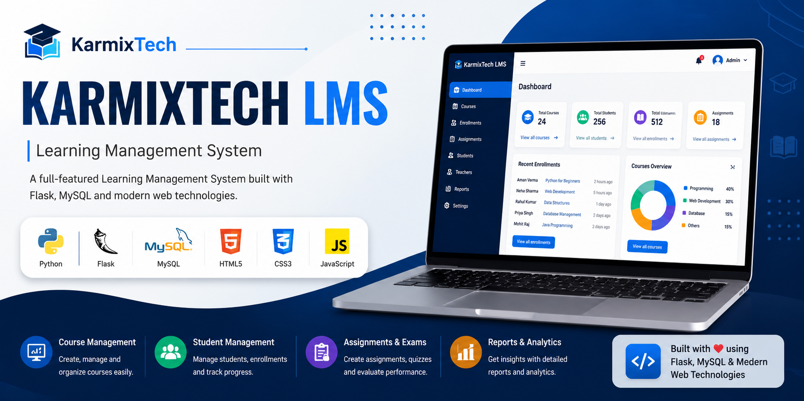
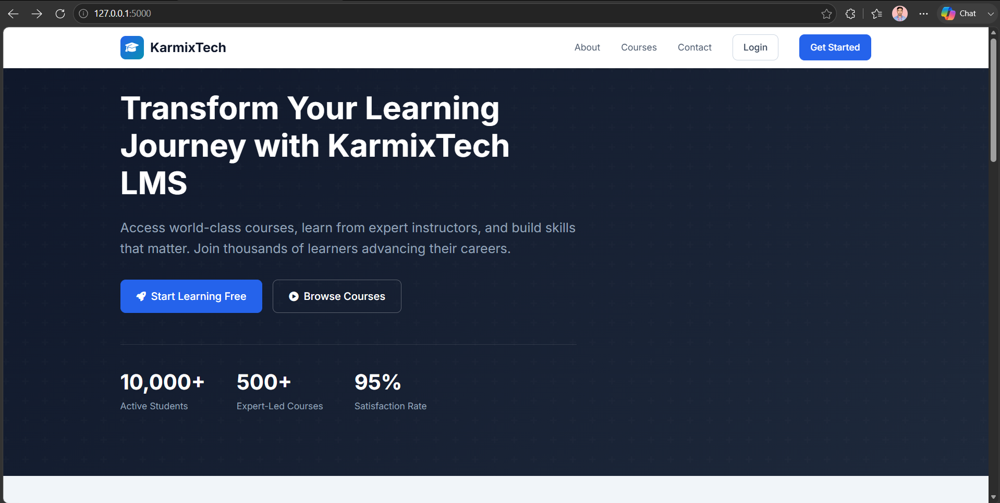
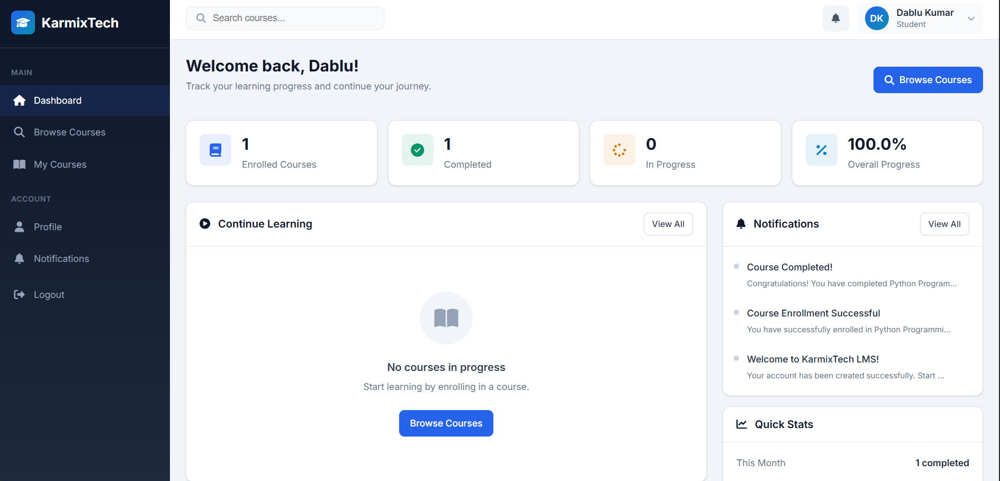
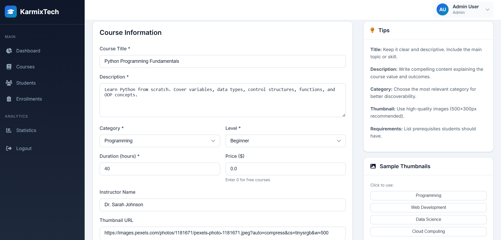
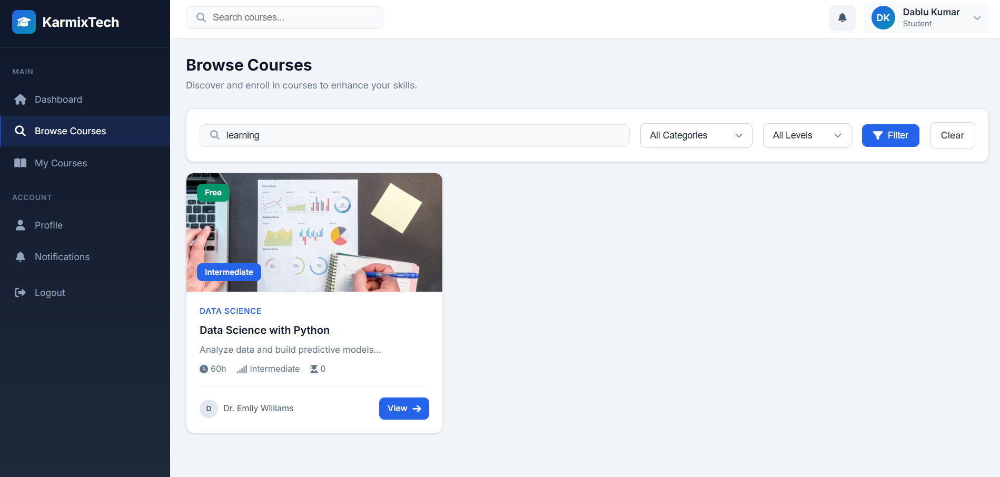
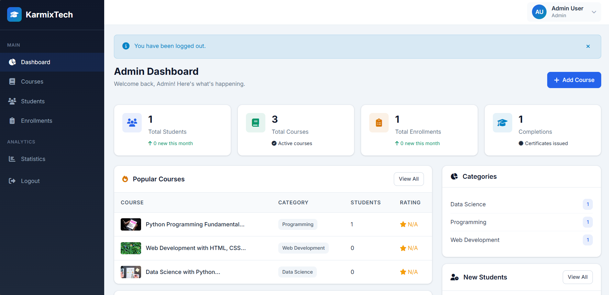
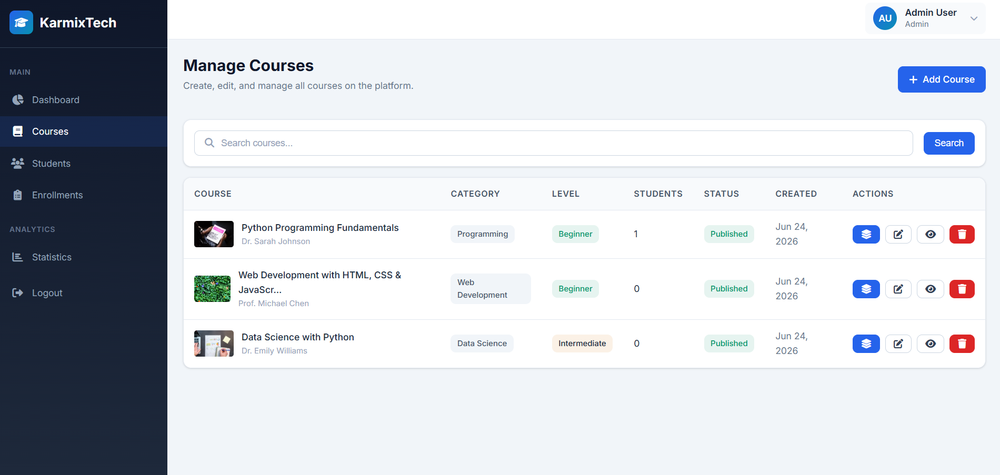

# KarmixTech LMS



A professional Full Stack Learning Management System (LMS) built with Python Flask and MySQL. The platform provides a complete learning environment where students can register, enroll in courses, watch video lectures, access PDF study materials, track learning progress, and receive certificates upon course completion. Administrators can efficiently manage courses, modules, lessons, enrollments, and students through a secure admin dashboard.


## Table of Contents

- [Overview](#overview)
- [Features](#features)
- [Technology Stack](#technology-stack)
- [Project Structure](#project-structure)
- [Installation Guide](#installation-guide)
- [Database Setup](#database-setup)
- [Configuration](#configuration)
- [API Documentation](#api-documentation)
- [Screenshots](#screenshots)
- [Future Enhancements](#future-enhancements)
- [License](#license)

## Overview

KarmixTech LMS is a professional-grade learning management platform designed for educational institutions, corporations, and training providers. It provides a complete solution for course delivery, student management, progress tracking, and analytics.

### Key Highlights

- Modern, responsive UI/UX design
- Secure authentication with password hashing
- Role-based access control (Student/Admin)
- RESTful API architecture
- Real-time progress tracking
- Dashboard analytics
- Comprehensive course management

## Features

### Student Features
- User registration and authentication
- Personal dashboard with learning statistics
- Browse and search courses
- Course enrollment
- **Watch embedded YouTube videos**
- **Download PDF lesson notes**
- Progress tracking with **auto-updating percentage**
- **Next/Previous lesson navigation**
- **Mark lessons as completed**
- Certificate generation upon 100% completion
- Profile management
- Change password functionality
- Notification center

### Admin Features
- Admin dashboard with analytics
- Course management (CRUD operations)
- **Module management (add, edit, delete, reorder)**
- **Lesson management with:**
  - Title and description
  - YouTube video URL (auto-extracts video ID)
  - PDF notes URL
  - Duration tracking
  - Order/reordering
  - Preview mode
  - Publish/unpublish
- Student management
- Enrollment tracking
- User activity monitoring
- Statistics and reports
- Category management

### Technical Features
- Clean code architecture (MVC pattern)
- RESTful API endpoints
- Form validation (client & server)
- Error handling pages (404, 403, 500)
- Pagination for data tables
- Search functionality
- Session management
- SQL injection protection
- CSRF protection ready

## Technology Stack

| Category | Technology |
|----------|------------|
| Backend | Python 3.11+, Flask |
| Database | MySQL |
| ORM | SQLAlchemy |
| Authentication | Flask-Login |
| Frontend | HTML5, CSS3, JavaScript |
| Styling | Custom CSS, CSS Variables |
| Icons | Font Awesome 6 |
| Fonts | Google Fonts (Inter) |
| HTTP Client | Fetch API |

## Project Structure

```
KarmixTech_LMS/
├── app.py                  # Main application entry point
├── config.py               # Configuration settings
├── requirements.txt        # Python dependencies
├── README.md               # Project documentation
│
├── static/
│   ├── css/
│   │   └── style.css      # Main stylesheet
│   ├── js/
│   │   └── main.js        # JavaScript functionality
│   └── images/            # Static images
│
├── templates/
│   ├── base.html          # Base template
│   ├── dashboard.html     # Dashboard layout
│   ├── index.html         # Landing page
│   ├── about.html         # About page
│   ├── contact.html       # Contact page
│   ├── auth/
│   │   ├── login.html     # Student login
│   │   ├── register.html  # Student registration
│   │   └── admin_login.html # Admin login
│   ├── student/
│   │   ├── dashboard.html
│   │   ├── courses.html
│   │   ├── course_detail.html
│   │   ├── my_courses.html
│   │   ├── profile.html
│   │   ├── learn.html
│   │   ├── notifications.html
│   │   └── change_password.html
│   ├── admin/
│   │   ├── dashboard.html
│   │   ├── courses.html
│   │   ├── course_form.html
│   │   ├── students.html
│   │   ├── student_detail.html
│   │   └── statistics.html
│   └── errors/
│       ├── 404.html
│       ├── 403.html
│       └── 500.html
│
├── models/
│   ├── __init__.py
│   ├── user.py             # User model
│   ├── course.py           # Course model
│   ├── enrollment.py       # Enrollment model
│   ├── progress.py         # Progress model
│   └── notification.py     # Notification model
│
├── routes/
│   ├── auth.py             # Authentication routes
│   ├── student.py          # Student routes
│   └── admin.py             # Admin routes
│
├── api/
│   ├── __init__.py
│   ├── courses.py          # Course API endpoints
│   ├── users.py            # User API endpoints
│   ├── enrollments.py      # Enrollment API endpoints
│   └── progress.py         # Progress API endpoints
│
└── services/
    ├── analytics.py        # Analytics service
    ├── course_service.py   # Course operations
    └── enrollment_service.py # Enrollment operations
```

## Installation Guide

### Prerequisites

- Python 3.11 or higher
- MySQL Server 8.0+
- Git
- pip (Python Package Manager)
- Visual Studio Code (Recommended)

### Step 1: Clone the Repository

```bash
git clone https://github.com/DabluKumar18/KarmixTech_LMS.git
cd KarmixTech_LMS
```

### Step 2: Create a Virtual Environment

```bash
python -m venv venv
```

**Windows**

```bash
venv\Scripts\activate
```

**Linux/macOS**

```bash
source venv/bin/activate
```

### Step 3: Install Dependencies

```bash
pip install -r requirements.txt
```

### Step 4: Configure Environment Variables

Create a `.env` file in the project root and add the following configuration:

```env
SECRET_KEY=your-secret-key-here

MYSQL_HOST=localhost
MYSQL_USER=root
MYSQL_PASSWORD=your_mysql_password
MYSQL_DATABASE=lms_db

FLASK_ENV=development
```

### Step 5: Create the Database

```sql
CREATE DATABASE lms_db;
```

### Step 6: Initialize the Database

```bash
python init_db.py
```

This command automatically creates all required database tables and inserts the initial sample data.

### Step 7: Run the Application

```bash
python app.py
```

Open your browser and visit:

```
http://127.0.0.1:5000
```

## Database Setup

This project uses **MySQL** as the database.

### 1. Create the Database

```sql
CREATE DATABASE lms_db;
```

### 2. Import the Database

Import the provided database backup:

```bash
mysql -u root -p lms_db < Karmix_db.sql
```
The `Karmix_db.sql` file contains the complete database schema along with sample data required to run the project.


## Configuration

Configure your application by creating a `.env` file in the project root.

```env
SECRET_KEY=your-secret-key-here

MYSQL_HOST=localhost
MYSQL_USER=root
MYSQL_PASSWORD=your_mysql_password
MYSQL_DATABASE=lms_db

FLASK_ENV=development
```

### Security Settings

- Session cookie HTTPOnly: Enabled
- Session lifetime: 24 hours
- Password hashing using `werkzeug.security`

## API Documentation

### Base URL

```
http://localhost:5000/api
```

### Authentication APIs

| Method | Endpoint | Description |
|--------|----------|-------------|
| POST | `/api/users/register` | Register a new user |
| POST | `/api/users/login` | Login a user |

**Sample Registration Request**

```json
{
  "email": "student@example.com",
  "password": "Password123",
  "first_name": "John",
  "last_name": "Doe"
}
```

---

### Course APIs

| Method | Endpoint | Description |
|--------|----------|-------------|
| GET | `/api/courses` | Get all available courses |
| GET | `/api/courses/:id` | Get course details |

**Query Parameters**

- `search`
- `category`
- `level`
- `page`
- `per_page`

---

### Enrollment APIs

| Method | Endpoint | Description |
|--------|----------|-------------|
| POST | `/api/enrollments` | Enroll in a course |
| GET | `/api/enrollments` | Get enrolled courses |

---

### Progress APIs

| Method | Endpoint | Description |
|--------|----------|-------------|
| GET | `/api/progress/:course_id` | Get course progress |
| POST | `/api/progress/:course_id/lesson/:lesson_id` | Mark lesson as completed |

## Screenshots

### Home Page



### Student Dashboard



### Course Details



### Learning Page



### Admin Dashboard



### Course Management



## Default Credentials

### Admin Account
- Email: `admin@karmixtech.com`
- Password: `Admin@123`

> **Note:** These credentials are for demonstration and testing purposes only. Change them before deploying the application in a production environment.

## Future Enhancements

- AI-powered course recommendations
- Instructor dashboard
- Course ratings and reviews
- Live classes with WebRTC
- Discussion forums
- Payment gateway integration
- Certificate generation and verification
- Email notifications
- Mobile application (React Native)
- Social login (Google & GitHub)
- Multi-language support
- Two-factor authentication (2FA)
- Badges and gamification

## Contributing

Contributions are welcome! Please feel free to submit a Pull Request.

1. Fork the repository
2. Create your feature branch (`git checkout -b feature/AmazingFeature`)
3. Commit your changes (`git commit -m 'Add some AmazingFeature'`)
4. Push to the branch (`git push origin feature/AmazingFeature`)
5. Open a Pull Request

## License

This project is licensed under the MIT License - see the [LICENSE](LICENSE) file for details.

## Acknowledgments

- Flask Documentation
- SQLAlchemy ORM
- MySQL Community
- Font Awesome
- Google Fonts
- Pexels (Images)

---

---

## Author

**Developed by Dablu Kumar** during the **KarmixTech Internship**.

⭐ If you found this project useful, don't forget to give it a star on GitHub!